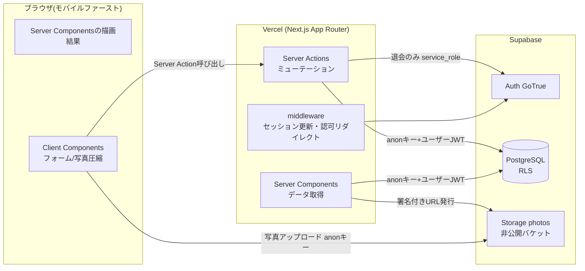
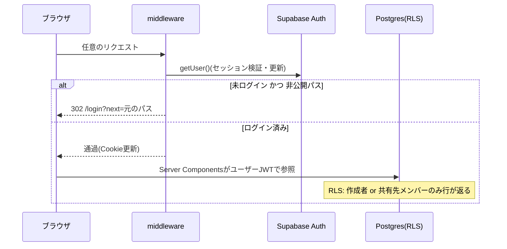

# アーキテクチャ設計

## 全体構成



## 技術スタック

| 層 | 技術 | 備考 |
|---|---|---|
| フロント/サーバー | Next.js 16(App Router)+ TypeScript | ホスティングはVercel |
| スタイル | Tailwind CSS v4 | デザイントークンは `globals.css` の `@theme` |
| 書体 | Zen Kaku Gothic New(本文)/ Shippori Mincho(見出し) | next/font/google |
| BaaS | Supabase(Auth / Postgres / RLS / Storage) | スキーマは `supabase/migrations/` のみで管理 |
| テスト | Vitest(ユニット)/ Playwright(E2E・RLS分離) | CIはGitHub Actions |

## セキュリティ原則(実装上の不変条件)

1. **アクセス制御はRLS一本**。サーバー/クライアントのコードは「見えたものを表示する」だけで、権限判定を持たない
2. anon キーのみをアプリで使用。`service_role` は退会処理(`src/lib/supabase/admin.ts`)だけが使い、`import "server-only"` でクライアントバンドル混入をビルド時に防止
3. 未ログインは middleware で `/login` へ(公開パス: `/login` `/signup` `/auth` `/terms` `/privacy`)。DB側でも anon ロールにはテーブルGRANTが無い(二重防御)
4. 権限が無いリソースはRLSで0件 → 画面は 404(存在自体を隠す)

## ディレクトリ構成

```
src/
├── middleware.ts               # セッション更新+認可リダイレクト
├── app/
│   ├── layout.tsx              # ルート(フォント・メタ)
│   ├── globals.css             # デザイントークン(@theme)
│   ├── terms/ privacy/         # 公開静的ページ
│   ├── (auth)/                 # 未ログイン画面
│   │   ├── actions.ts          #   signup / login / logout
│   │   ├── login/ signup/
│   ├── (app)/                  # 要ログイン画面(共通ヘッダー)
│   │   ├── layout.tsx          #   ヘッダー(通知未読・ナビ)+認可
│   │   ├── page.tsx            #   ホーム
│   │   ├── calendar/           #   カレンダー(月/週/一覧+レイヤー)
│   │   ├── days/[date]/        #   その日ページ
│   │   ├── items/              #   アイテムCRUD・リンク・写真
│   │   ├── expenses/           #   家計(月次集計・費目)
│   │   ├── spaces/             #   スペース(一覧/作成/各スペース)
│   │   │   └── [id]/           #   フィード/カレンダー/アルバム/精算/
│   │   │                       #   プロジェクト/タスク/予実/文書/メンバー/設定
│   │   ├── invite/[token]/     #   招待の受け取り
│   │   ├── notifications/      #   通知
│   │   └── account/            #   プロフィール・退会
├── lib/
│   ├── supabase/               # server / client / middleware / admin
│   ├── date.ts items.ts spaces.ts settle.ts
└── types/database.ts           # スキーマ型定義(手書き)

supabase/migrations/            # スキーマ+RLS(全12本)
scripts/db/                     # ローカルRLS分離チェック(素のPostgreSQL用)
scripts/design/                 # 設計書スクリーンショット撮影ツール
e2e/                            # Playwright(RLS分離+フェーズ別E2E)
```

## 認証・セッションフロー



## 定期処理

| 処理 | 実装 | 頻度 |
|---|---|---|
| Supabase無料プランの停止防止ping | `.github/workflows/supabase-keepalive.yml`(REST へ SELECT 1件) | 週2回(月・木) |
| CI(型/リント/ユニット/マイグレーション検証/RLS分離E2E) | `.github/workflows/ci.yml` | push / PR |
