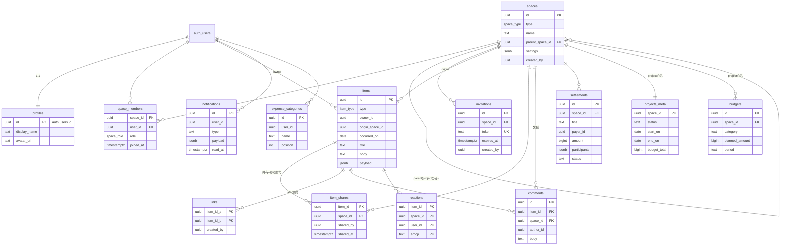

# データベース設計

スキーマの原本は `supabase/migrations/`(全12本)。ここでは一覧性のために整理する。

## ER図

## 列挙型

| 型 | 値 |
|---|---|
| space_type | personal / group / organization / project |
| space_role | owner / admin / member |
| item_type | event / diary / expense / task / document / photo |
| settlements.status | open / settled |
| projects_meta.status | planned / active / done |
| notifications.type | shared / comment / reaction / task_assigned / settlement |

## items.payload(type別)

| type | payload | 例 |
|---|---|---|
| event | all_day, start_time "HH:MM", end_time, place, memo | `{"all_day":false,"start_time":"09:00","place":"奥多摩"}` |
| diary | decoration { paper: plain/lined/grid/washi, stamp } | `{"decoration":{"paper":"lined","stamp":"花丸"}}` |
| expense | amount(正整数・円), kind income/expense, category | `{"amount":1840,"kind":"expense","category":"交通"}` |
| task | status todo/doing/done, assignee(uuid, 任意) | `{"status":"doing","assignee":"..."}` |
| photo | path(photosバケット内 `{user_id}/{uuid}.jpg`), width?, height? | `{"path":"u1/ab.jpg"}` |
| document | (なし) | `{}` |

## RLSポリシー一覧

閲覧の原則は一本: **「自分が作成者」または「item_shares 経由で共有されたスペースのメンバー」**(§6.3)。
anon ロールにはテーブルGRANT自体が無い(未ログインは全拒否)。

| テーブル | SELECT | INSERT | UPDATE | DELETE |
|---|---|---|---|---|
| profiles | 本人 or 同一スペースのメンバー | (サインアップトリガのみ) | 本人 | − |
| spaces | メンバー or 親組織のowner/admin(メタ閲覧) | (RPCのみ) | owner/admin | − |
| space_members | 所属スペースのメンバー | (RPCのみ) | owner(owner以外の行をmember/adminへ) | 本人(owner以外)/ owner・adminがowner以外を除名 |
| invitations | owner/admin | owner/admin(本人名義) | − | owner/admin |
| items | owner or 共有先メンバー | owner本人 かつ origin のメンバー | owner(※taskのstatusのみRPCで担当者も) | owner |
| item_shares | item owner or 共有先メンバー | item owner かつ 共有先メンバー(本人名義) | − | item owner |
| links | 両端とも閲覧可 | 作成者本人 かつ 両端閲覧可 | − | 作成者 |
| comments | スペースメンバー | メンバー本人 かつ そのスペースへ共有中のアイテム | − | 本人 |
| reactions | スペースメンバー | 同上 | − | 本人 |
| settlements | スペースメンバー | メンバー本人 | 記録者 or 支払者 | 記録者 or 支払者 |
| projects_meta | メンバー or 親組織のowner/admin | (create_projectのみ) | owner/admin | − |
| budgets | メンバー or 親組織のowner/admin | owner/admin | owner/admin | owner/admin |
| notifications | 本人 | (トリガのみ) | 本人(既読化) | − |
| expense_categories | 本人 | 本人 | 本人 | 本人 |
| storage.objects(photos) | 自分のフォルダ or 対応するphotoアイテムが共有されている | 自分のフォルダのみ | − | 自分のフォルダのみ |

### RLSヘルパー関数(SECURITY DEFINER・booleanのみ返す)

ポリシー同士の再帰評価を避けるため、判定はすべて以下に集約(`search_path=''` 固定・anonは実行不可)。

| 関数 | 判定 |
|---|---|
| is_space_member(space_id) | 現在ユーザーがそのスペースのメンバーか |
| owns_item(item_id) | アイテムの作成者か |
| has_shared_access(item_id) | 自分がメンバーのスペースへ共有されているか |
| can_view_item(item_id) | owns or has_shared_access |
| shares_space_with(user_id) | 同じスペースに属しているか(profiles用) |
| space_role_of(space_id) | ロールを返す(非メンバーはnull) |
| is_item_shared_to(item_id, space_id) | 特定スペースへの共有有無 |
| is_parent_org_manager(space_id) | 親組織のowner/adminか |

## DB関数(RPC)・トリガ

| 種類 | 名前 | 内容 |
|---|---|---|
| RPC(definer) | create_group(name) / create_organization(name) | スペース作成+ownerメンバー登録を1トランザクションで |
| RPC(definer) | create_project(org_id, name) | 組織owner/adminのみ。projects_meta も同時作成 |
| RPC(definer) | add_project_member(project_id, user_id) | プロジェクトowner/adminが親組織メンバーを追加 |
| RPC(definer) | invitation_preview(token) | 参加前にスペース名・期限切れを返す |
| RPC(definer) | accept_invitation(token) | 期限内トークンで member として参加 |
| RPC(definer) | update_task_status(item_id, status) | 作成者+担当者のみ payload.status を変更(§6.3の唯一の例外) |
| RPC(invoker) | expense_monthly_summary(month) | 自分の収支の月次集計(RLS適用) |
| RPC(invoker) | space_expense_summary(space_id) | スペースへ共有された収支の合算(RLS適用) |
| トリガ | handle_new_user | サインアップ時: profiles+個人スペース+既定費目を作成 |
| トリガ | set_updated_at | 各テーブルの updated_at 自動更新 |
| トリガ | notify_on_share / comment / reaction / task_assign / settlement | アプリ内通知の生成(F-11-1) |

## マイグレーション一覧

| # | ファイル | 内容 |
|---|---|---|
| 1 | 20260719100001_profiles.sql | profiles、set_updated_at |
| 2 | 20260719100002_spaces.sql | spaces / space_members、型 |
| 3 | 20260719100003_items.sql | items / item_shares、型 |
| 4 | 20260719100004_rls.sql | ヘルパー関数・GRANT・基本RLS |
| 5 | 20260719100005_signup_trigger.sql | サインアップトリガ |
| 6 | 20260719100006_links.sql | links+RLS |
| 7 | 20260719100007_expense_categories.sql | 費目+既定seed |
| 8 | 20260719100008_expense_summary.sql | 月次集計RPC |
| 9 | 20260719100009_sharing.sql | グループ/招待/コメント/リアクション+RLS |
| 10 | 20260719100010_p4_album_settlements.sql | photosバケット+Storage RLS、settlements |
| 11 | 20260719100011_orgs.sql | 組織/プロジェクト/予実/タスクRPC |
| 12 | 20260719100012_notifications.sql | notifications+通知トリガ |
