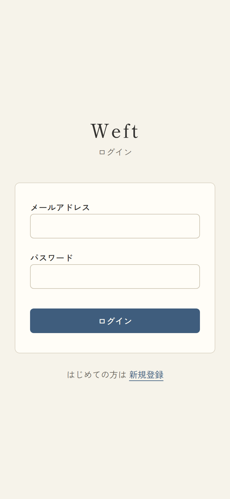
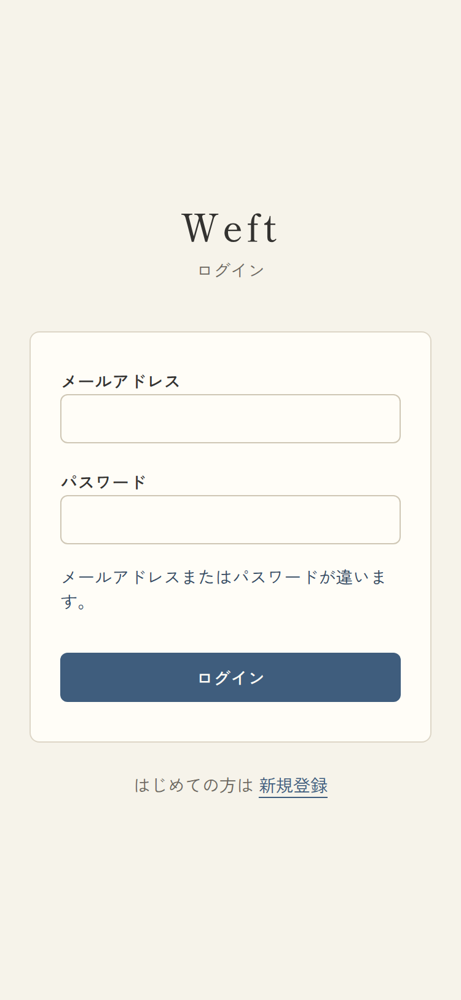
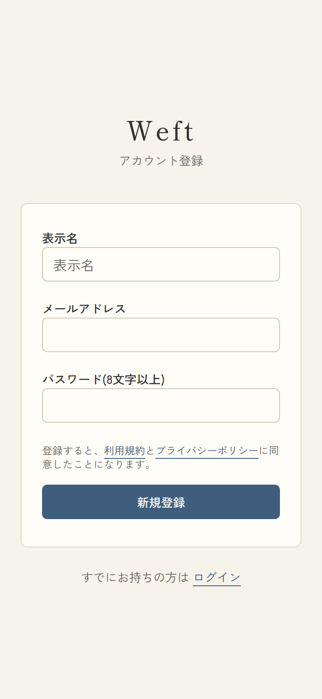
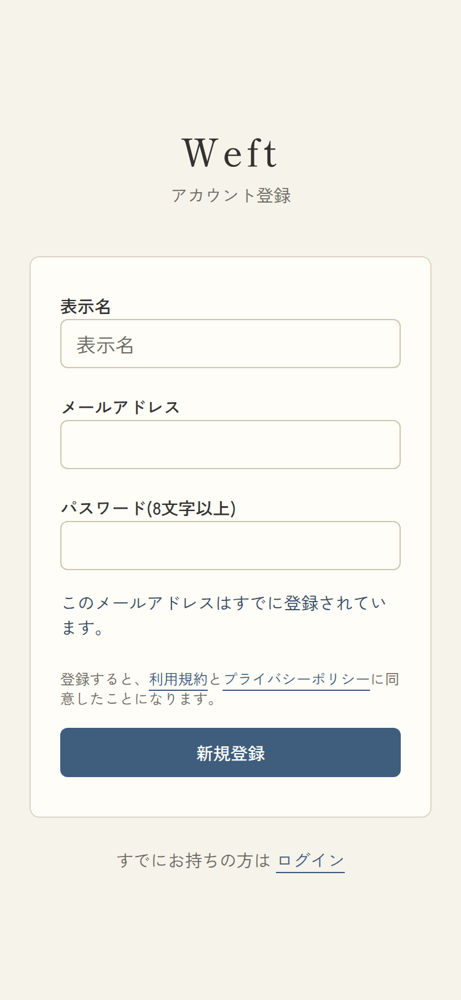

# 01. 認証

## 1-1. ログイン

- URL: `/login` / アクセス: 公開(ログイン済みは `/` へ302)/ 対応項番: F-01-1

| 通常 | 認証エラー |
|---|---|
|  |  |

### 画面項目

| No | 項目 | 種別 | 必須 | 内容・表示条件 |
|---|---|---|---|---|
| 1 | ロゴ「Weft」+「ログイン」 | 見出し | − | 常時 |
| 2 | メールアドレス | input(email) | ○ | autocomplete=email |
| 3 | パスワード | input(password) | ○ | autocomplete=current-password |
| 4 | エラー文言 | alert | − | **認証失敗時のみ表示**:「メールアドレスまたはパスワードが違います。」 |
| 5 | ログイン | ボタン(藍) | − | 送信中は「ログインしています…」+disabled |
| 6 | 「はじめての方は 新規登録」 | リンク | − | 常時 → `/signup` |
| 7 | next(hidden) | hidden | − | `?next=` があるときのみ。ログイン後の戻り先(自サイトパスのみ有効) |

### 処理

| 操作 | 処理 | 成功 | 失敗 |
|---|---|---|---|
| ログイン | Server Action login(auth.signInWithPassword) | `next` または `/` へ遷移 | No.4のエラー表示・入力保持 |

## 1-2. 新規登録

- URL: `/signup` / アクセス: 公開(ログイン済みは `/` へ302)/ 対応項番: F-01-1, F-01-3, §9

| 通常 | 登録済みエラー |
|---|---|
|  |  |

### 画面項目

| No | 項目 | 種別 | 必須 | 内容・表示条件 |
|---|---|---|---|---|
| 1 | ロゴ「Weft」+「アカウント登録」 | 見出し | − | 常時 |
| 2 | 表示名 | input | − | placeholder「表示名」。未入力時はメールのローカル部が表示名になる |
| 3 | メールアドレス | input(email) | ○ | |
| 4 | パスワード(8文字以上) | input(password) | ○ | minLength=8(HTML+サーバー両方で検証) |
| 5 | エラー文言 | alert | − | 失敗時のみ。登録済み:「このメールアドレスはすでに登録されています。」/ 8文字未満:「パスワードは8文字以上にしてください。」/ その他:「登録できませんでした。時間をおいてお試しください。」 |
| 6 | 同意文言 | テキスト | − | 常時。「利用規約」「プライバシーポリシー」はリンク(§9) |
| 7 | 新規登録 | ボタン(藍) | − | 送信中「登録しています…」 |
| 8 | 「すでにお持ちの方は ログイン」 | リンク | − | → `/login` |

### 処理

| 操作 | 処理 | 成功 | 失敗 |
|---|---|---|---|
| 新規登録 | Server Action signup(auth.signUp)。**成功時DBトリガで profiles+個人スペース(DB上の名称「わたしの帳面」。UIには非表示)+既定費目8種を自動作成**(F-01-3) | `/` へ遷移(メール確認オフ時) | No.5のエラー表示 |

### パターン

| パターン | 挙動 |
|---|---|
| 正常登録 | 即ログイン状態でホーム(空状態)へ |
| 登録済みメール | エラー表示(スクリーンショット右) |
| 本番公開後(メール確認オン) | 確認メール送信後の案内(Supabase設定。第1弾はオフ) |
