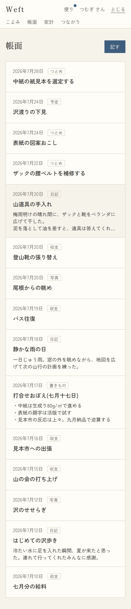
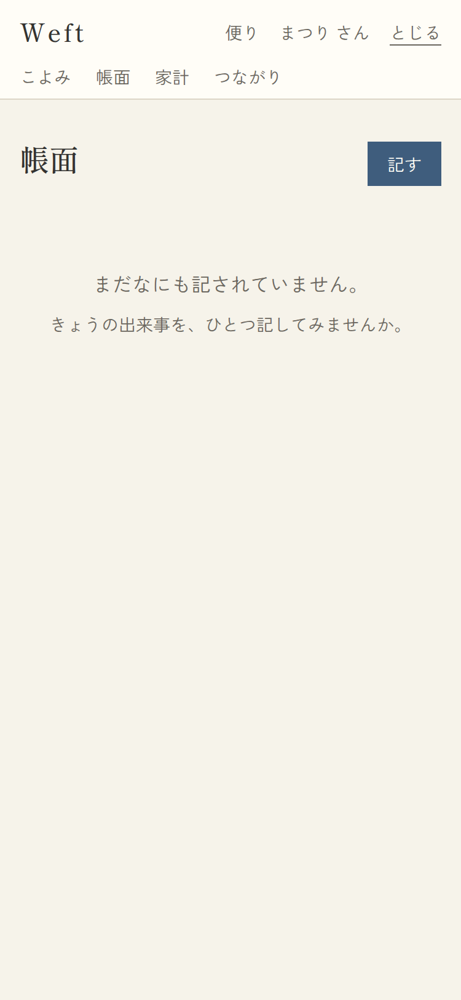

# 02. 帳面(ホーム)

- URL: `/`(`?page=N`) / アクセス: 要ログイン / 対応項番: 品質基準(ページネーション)

自分が作成したアイテムの新しい順(発生日降順→作成降順)一覧。**RLSにより自分の行しか返らない**(他人の共有分はこよみ・回覧板で見る)。

| 記録あり | 空(新規ユーザー) |
|---|---|
|  |  |

## 画面項目

| No | 項目 | 内容・表示条件 |
|---|---|---|
| 1 | 見出し「帳面」 | 常時(明朝) |
| 2 | 記す(藍ボタン) | 常時 → `/items/new`(既定は日記タブ) |
| 3 | 記録リスト | **1件以上あるとき**。1行=①日付+種別ラベル(予定/日記/収支/つとめ/書きもの/写真) ②題(あるとき・中字) ③本文(あるとき・3行で省略)。行全体がリンク → `/items/{id}` |
| 4 | 空状態 | **0件のとき**:「まだなにも記されていません。/ きょうの出来事を、ひとつ記してみませんか。」 |
| 5 | ページネーション | **21件以上のとき**。「まえの頁」(2頁目以降)/「n / N 頁」/「つぎの頁」(最終頁以外) |

## 処理

| 操作 | 遷移 |
|---|---|
| 記す | `/items/new` |
| 記録行タップ | `/items/{id}`(詳細) |
| まえの頁/つぎの頁 | `/?page=N±1` |

## パターン

| パターン | 表示 |
|---|---|
| 0件 | No.4 の空状態(リスト・ページネーション非表示) |
| 1〜20件 | リストのみ(ページネーション非表示) |
| 21件以上 | リスト+ページネーション |
| page が範囲外/不正 | 1頁目として扱う(エラーにしない) |
