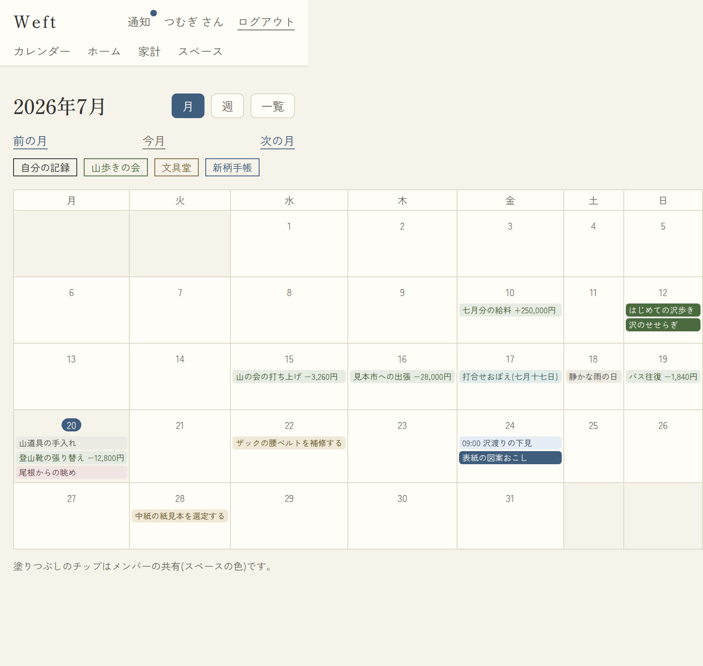
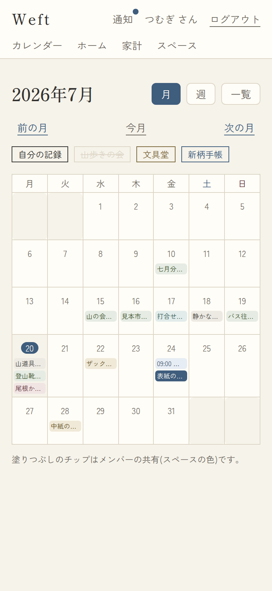
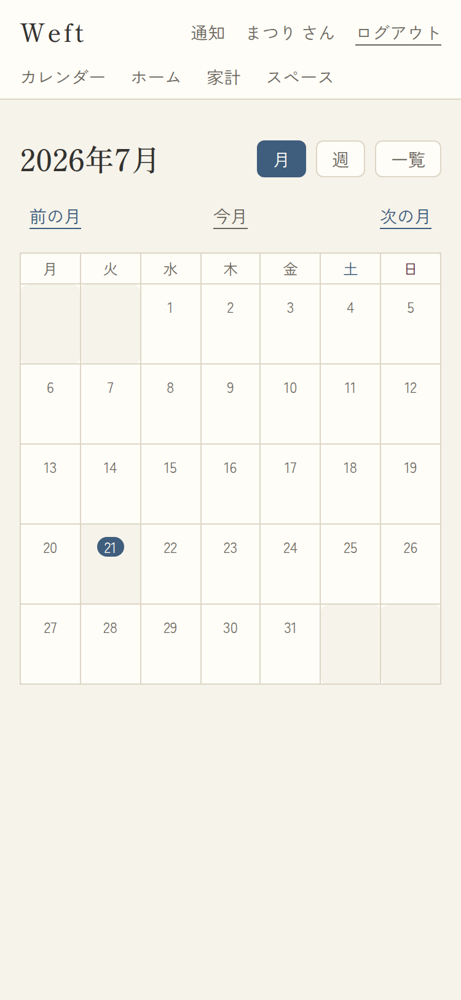
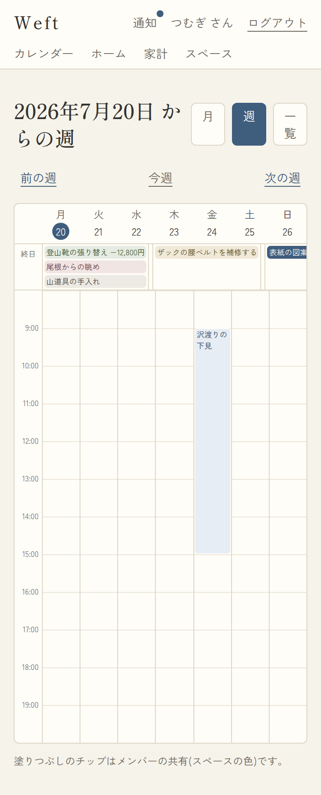
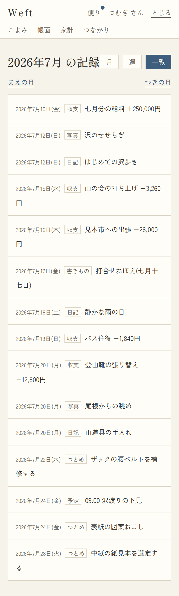

# 03. カレンダー

- URL: `/calendar?view=month|week|list&month=YYYY-MM&date=YYYY-MM-DD&hide=<spaceId,...>`
- アクセス: 要ログイン / 対応項番: F-03-1, F-03-3, F-03-5

自分の記録+**参加スペースへ共有された記録**が重なって表示される(RLSがそのまま可視範囲)。

## 3-1. 月表示(既定)

| レイヤー全表示 | 「山歩きの会」レイヤーOFF | 空(新規ユーザー) |
|---|---|---|
|  |  |  |

### 画面項目

| No | 項目 | 内容・表示条件 |
|---|---|---|
| 1 | 見出し「YYYY年M月」 | 常時 |
| 2 | 表示切替タブ(月/週/一覧) | 常時。選択中は藍地白文字 |
| 3 | まえの月 / 今月 / つぎの月 | 常時 |
| 4 | レイヤーチップ(F-03-3) | **参加スペースが1つ以上あるとき**。「わたし」+各スペース名(スペースのテーマカラーの枠)。OFF中は灰色+取り消し線。タップでON/OFFトグル(`hide=`に追加/削除) |
| 5 | 月グリッド | 月曜はじまり。前後月セルは生成り地。**今日**は日番号が藍丸白抜き |
| 6 | 記録ドット(F-03-5) | その日に記録がある種別ぶん表示。●藍=予定 / ●墨=日記 / ●薄墨=収支 / ○=タスク / **◆(45度回転・スペース色)=メンバーの共有** |
| 7 | 凡例 | 常時(◆はスペース参加時のみ) |

### 処理

| 操作 | 遷移・処理 |
|---|---|
| 日付セル | `/days/{date}`(その日ページ) |
| レイヤーチップ | 同画面(hideパラメータをトグル)。OFFにしたレイヤーのドットが消える |
| 月移動 | `?month=` を±1ヶ月 |

## 3-2. 週表示

| No | 項目 | 内容・表示条件 |
|---|---|---|
| 1 | 見出し「M月D日 からの週」 | 週の月曜 |
| 2 | 前の週 / 今週 / 次の週 | 常時 |
| 3 | 曜日ヘッダー | 曜日+日付。今日は藍丸白抜き。タップでその日ページへ。土=藍・日=蘇芳 |
| 4 | 終日行 | 時刻のない予定・日記・収支・タスク等をチップで表示(各日最大3件+「+N件」)。チップ→詳細へ |
| 5 | 時間グリッド | 時刻つき予定をブロック表示(高さ=時間幅、最低30分ぶん)。表示帯は8〜20時を基本に予定へ追随。ブロック→詳細へ |

チップ/ブロックの色: 自分の記録=種別の淡色、メンバーの共有=スペース色の塗り(月表示と同じ)。
一行表記: 予定=「HH:MM タイトル」(終日はタイトルのみ)/ 収支=「メモ −1,234円」/ その他=タイトルまたは本文冒頭。

## 3-3. 一覧表示

| No | 項目 | 内容・表示条件 |
|---|---|---|
| 1 | 見出し「YYYY年M月 の記録」 | |
| 2 | まえの月 / つぎの月 | |
| 3 | 記録リスト | 月内全記録を日付昇順。1行=日付(曜日)+種別+一行表記 → `/items/{id}` |
| 4 | 空状態 | 0件時「この月の記録はまだありません。」 |

## パターン

| パターン | 挙動 |
|---|---|
| month/date が不正値 | 今月/今日にフォールバック(エラーにしない) |
| スペース未参加 | レイヤーチップ・◆凡例は非表示(自分のドットのみ) |
| 共有記録の帰属 | 他人の記録は共有元スペースのレイヤー(複数共有時は最初の1つ) |
| レイヤーOFFの保存 | URLパラメータのみ(共有・ブックマーク可能。永続化はしない) |
