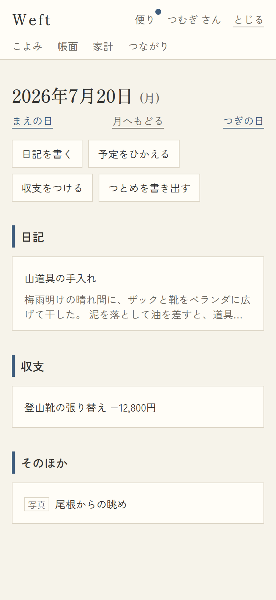
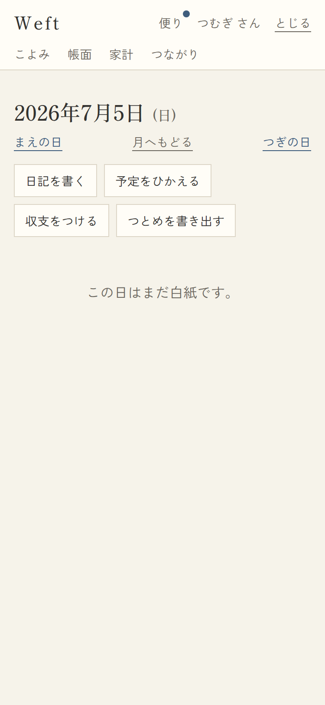

# 04. その日ページ

- URL: `/days/{YYYY-MM-DD}` / アクセス: 要ログイン / 対応項番: F-03-5

日付タップで開く「その日の全記録」。自分の記録+その日に共有された記録が種別ごとに並ぶ。

| 記録あり(今日) | 白紙の日 |
|---|---|
|  |  |

## 画面項目

| No | 項目 | 内容・表示条件 |
|---|---|---|
| 1 | 見出し「YYYY年M月D日(曜)」 | 常時 |
| 2 | まえの日 / 月へもどる / つぎの日 | 常時。月へもどる→その日の月の月表示 |
| 3 | 作成導線4つ | 常時:「日記を書く」「予定をひかえる」「収支をつける」「つとめを書き出す」→ `/items/new?type=◯&date=この日` |
| 4 | 種別セクション | **その種別の記録があるときのみ**。順序: 予定→日記→収支→つとめ(→そのほか=書きもの・写真)。見出しは藍の縦帯 |
| 5 | 記録行 | 一行表記(+日記は本文2行プレビュー)→ `/items/{id}` |
| 6 | 空状態 | 記録0件時:「この日はまだ白紙です。」 |

## 処理

| 操作 | 遷移 |
|---|---|
| 作成導線 | 日付が引き継がれた作成フォームへ |
| 記録行 | アイテム詳細へ |
| まえの日/つぎの日 | `/days/{±1日}` |

## パターン

| パターン | 挙動 |
|---|---|
| 日付が不正(2026-02-30等) | 今日へリダイレクト(正規化) |
| 記録0件 | 空状態+作成導線のみ |
| 共有された他人の記録 | 同じセクションに混ざって表示(タップで詳細=閲覧のみ) |
| アイテム保存後の戻り先 | 作成・編集後はこのページへ戻る(記録がその場で確認できる) |
