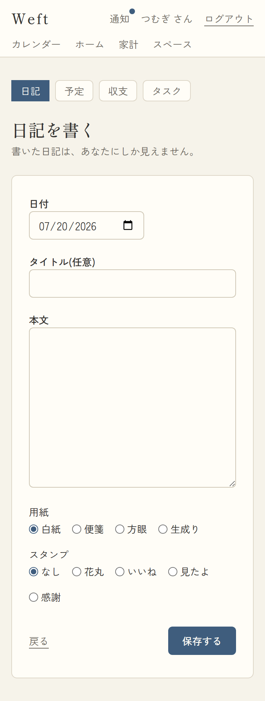
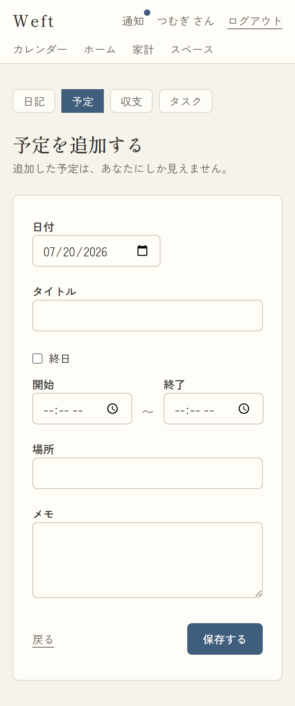
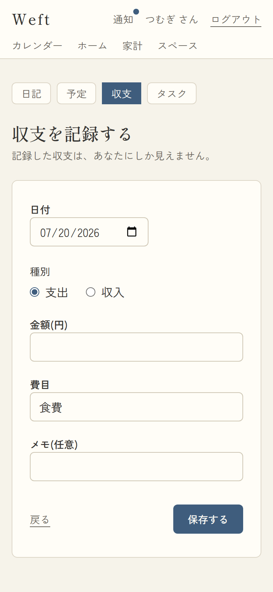
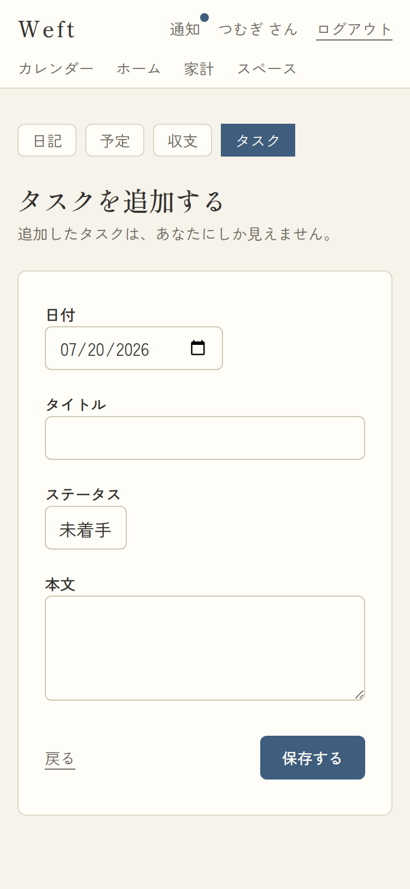
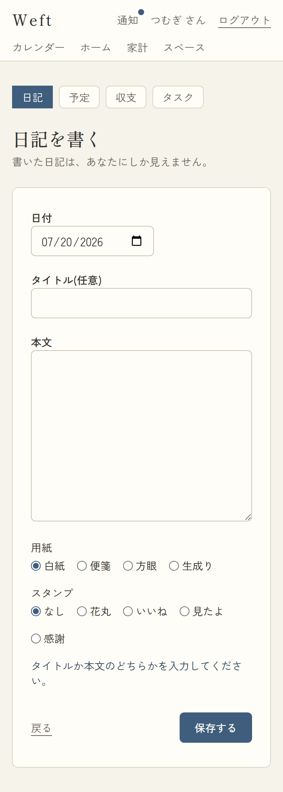

# 05. アイテム作成

- URL: `/items/new?type=diary|event|expense|task&date=YYYY-MM-DD&link=<itemId>`
- アクセス: 要ログイン / 対応項番: F-03-2, F-04-1/2/4, F-05-1, F-03-4/F-09-3(link)

| 日記 | 予定 | 収支 | タスク |
|---|---|---|---|
|  |  |  |  |

検証エラー(日記でタイトルも本文も空のまま送信):

## 共通項目

| No | 項目 | 種別 | 必須 | 内容・表示条件 |
|---|---|---|---|---|
| 1 | 種別タブ(日記/予定/収支/タスク) | リンク | − | 常時。選択中は藍地。`date`/`link` を引き継いで切替 |
| 2 | 見出し+注記 | | − | 種別ごと(例: 日記=「日記を書く/書いた日記は、あなたにしか見えません。」)**デフォルト非公開の明示** |
| 3 | 日付 | date | ○ | 既定=URLの`date`(なければ今日) |
| 4 | エラー文言 | alert | − | 検証失敗時のみ(下表) |
| 5 | 戻る | リンク | − | → `/days/{date}` |
| 6 | 保存する | ボタン(藍) | − | 送信中「保存しています…」 |
| 7 | link_to(hidden) | hidden | − | `?link=` 指定時のみ。**保存時に自動で双方向リンクを作成**(F-03-4/F-09-3) |

## 種別ごとの項目

### 日記(type=diary)

| 項目 | 種別 | 必須 | 内容 |
|---|---|---|---|
| タイトル(任意) | input | −(※) | ※タイトルか本文のどちらか必須 |
| 本文 | textarea(8行) | −(※) | |
| 用紙 | radio | − | 白紙(既定)/便箋/方眼/生成り(F-04-4) |
| スタンプ | radio | − | なし(既定)/花丸/よき/拝見/感謝 |

### 予定(type=event)

| 項目 | 種別 | 必須 | 内容 |
|---|---|---|---|
| タイトル | input | ○(※タイトルか本文) | |
| 終日 | checkbox | − | ONのとき保存時に時刻を破棄 |
| 開始〜終了 | time×2 | − | |
| 場所 / メモ | input / textarea | − | |

### 収支(type=expense)

| 項目 | 種別 | 必須 | 内容 |
|---|---|---|---|
| 種別 | radio | ○ | 支出(既定)/収入 |
| 金額(円) | number | ○ | 1以上の整数 |
| 費目 | input+datalist | − | 自分の費目一覧を候補表示・**自由入力も可**。空→「その他」 |
| メモ(任意) | input | − | |

### タスク(type=task)

| 項目 | 種別 | 必須 | 内容 |
|---|---|---|---|
| タイトル | input | ○(※タイトルか本文) | |
| ステータス | select | − | 未着手(既定)/進行中/完了 |
| 本文 | textarea(3行) | − | |

## 処理・検証

| 操作 | 検証(エラー文言) | 成功時 |
|---|---|---|
| 保存する | 日記・予定・タスク:「タイトルか本文のどちらかを入力してください。」/ 収支:「金額は1円以上の整数で入れてください。」/ 種別不正:「種別が正しくありません。」 | items INSERT(origin=個人スペース=**非公開で生まれる**)→ link指定時はリンクも作成 → `/days/{日付}` へ |

## パターン

| パターン | 挙動 |
|---|---|
| type未指定/不正 | 日記タブになる |
| date不正 | 今日に正規化 |
| 派生導線から(link付き) | 保存後、元アイテムと自動で「結びついた記録」になる |
| 検証エラー | alert表示・入力値は保持 |
