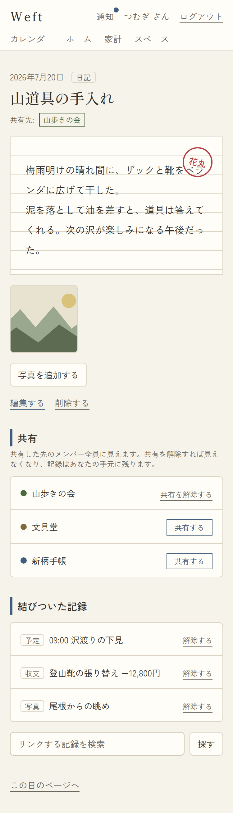
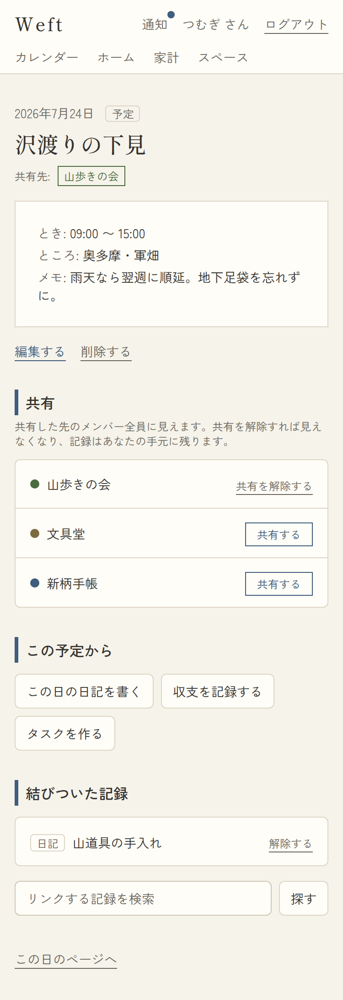
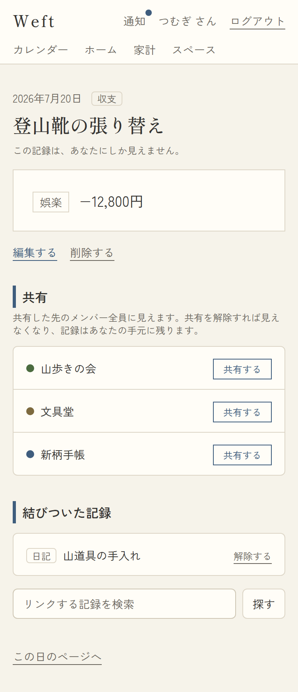
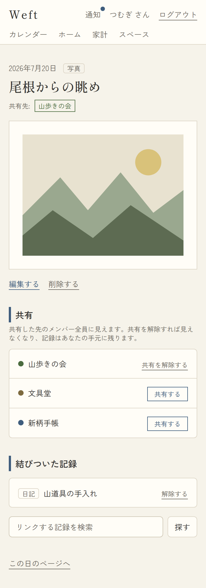
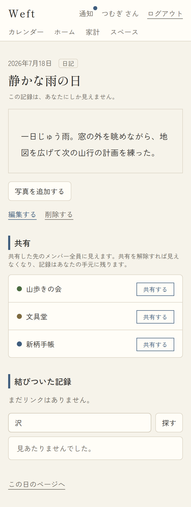
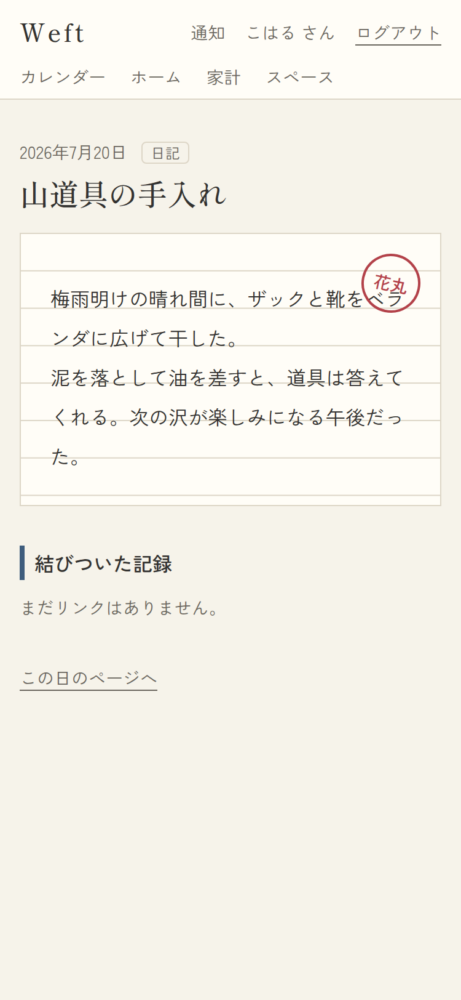
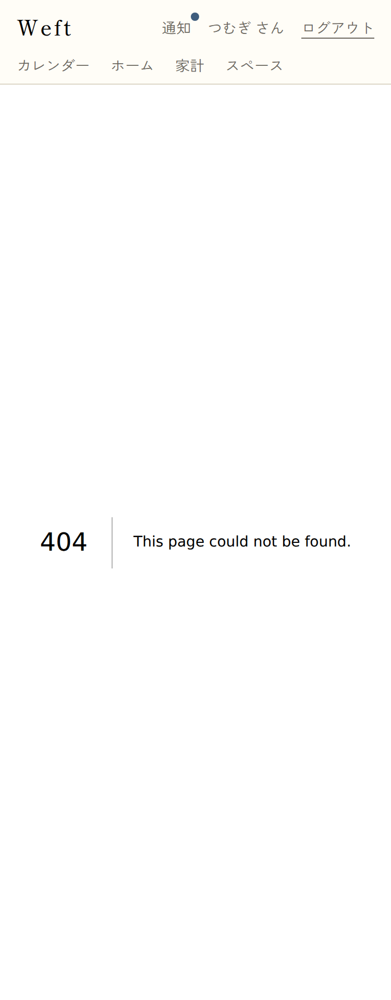
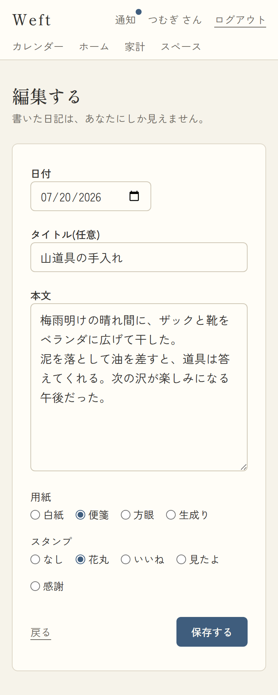

# 06. アイテム詳細・編集

- URL: `/items/{id}`(詳細)・`/items/{id}/edit`(編集)・`?q=語`(リンク検索)
- アクセス: 要ログイン。**閲覧権限が無いIDは404(存在自体を隠す)**
- 対応項番: F-03-4, F-04-1/4, F-06-1/3/4, F-09-1/2/4/5

## スクリーンショット(パターン)

| 日記(装飾+写真+リンク+共有中) | 予定(派生導線) | 収支 |
|---|---|---|
|  |  |  |

| 写真 | リンク検索結果 | 他人の共有アイテムを開いた場合 | 権限なし/不存在(404) |
|---|---|---|---|
|  |  |  |  |

編集:

## 画面項目(詳細)

| No | 項目 | 内容・表示条件 |
|---|---|---|
| 1 | 日付+種別ラベル | 常時 |
| 2 | タイトル(明朝) | null時「(無題)」 |
| 3 | 共有バッジ(F-06-4) | **共有中**: 「共有先: [スペース名]…」(スペース色の枠)/ **未共有かつ自分のもの**: 「この記録は、あなたにしか見えません。」/ 他人のものは非表示 |
| 4 | 本文カード | 種別ごと(下表)。**日記は用紙装飾**(白紙/便箋の罫線/方眼/生成り)を背景に描画、**スタンプ**は右上に朱色の丸印 |
| 5 | 結びついた写真 | **リンク先に写真があるとき**: 正方形サムネイルのグリッド(署名付きURL・1時間)→写真詳細へ |
| 6 | 写真を追加する | **自分の日記のみ**。ファイル選択→クライアント圧縮→アップロード→photoアイテム+自動リンク。処理中「アップロードしています…」。失敗時alert |
| 7 | 編集する / 削除する | **自分のもののみ**。削除する=即削除(確認なし・リンク等はカスケード)→ホームへ |
| 8 | 共有セクション(F-06-1/3) | **自分のもの かつ 参加スペースが1つ以上**。スペースごとに「共有する」(枠ボタン)⇄「共有を解除する」(下線)。注記に共有解除の説明 |
| 9 | この予定から(F-03-4) | **自分の予定のみ**:「この日の日記を書く/収支を記録する/タスクを作る」→ `?date=この日&link=このID` 付き作成へ |
| 10 | 結びついた記録(F-09-4) | リンク済みアイテムの一覧(種別+一行表記)→詳細へ。**自分のものには「ほどく」**(リンク解除)。0件時「まだ結びつきはありません。」**閲覧できない相手先のリンクはRLSで行ごと非表示**(F-09-5) |
| 11 | 結びつける検索(F-09-1) | **自分のもののみ**。GET検索(`?q=`)→タイトルの部分一致10件(リンク済み・自身は除外)+「結びつける」ボタン。0件時「見あたりませんでした。」 |
| 12 | この日のページへ | 常時 → `/days/{日付}` |

### 種別ごとの本文カード

| 種別 | 表示 |
|---|---|
| diary | 本文(用紙・スタンプ装飾)。本文なし時「本文はありません。」 |
| event | とき(終日/HH:MM〜HH:MM/時刻さだめず)・ところ・メモ |
| expense | 費目バッジ+「−12,800円」(収入は藍色で+) |
| task | ステータスバッジ(未着手/進行中/完了)+本文 |
| photo | 画像(署名付きURL・最大高さ制限) |
| document | 本文 |

## 画面項目(編集 `/items/{id}/edit`)

作成フォーム(05)と同一項目・同一検証。相違点:

| 項目 | 内容 |
|---|---|
| 見出し | 「編集する」/ ボタン「保存する」(送信中「保存しています…」) |
| アクセス | **作成者のみ**(他人・対象外種別は404) |
| 成功時 | `/items/{id}` へ戻る |

## パターン

| パターン | 挙動 |
|---|---|
| 他人の共有アイテム | 閲覧のみ(No.3/6/7/8/9/11 非表示。リンクは双方閲覧可能なもののみ表示) |
| 権限なし・不存在ID | 404(区別しない) |
| 写真アップロード失敗(>10MB等) | 「写真は10MBまでにしてください。」/「アップロードできませんでした。…」 |
| 共有操作 | 即時反映(共有する→バッジ追加+共有先のフィード・通知へ/共有を解除する→相手から見えなくなる。**元データは残る**) |
