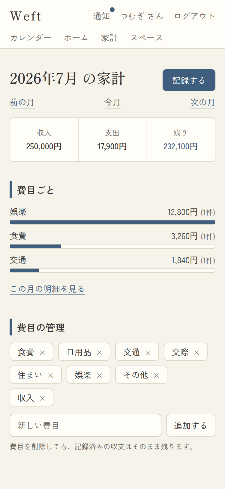
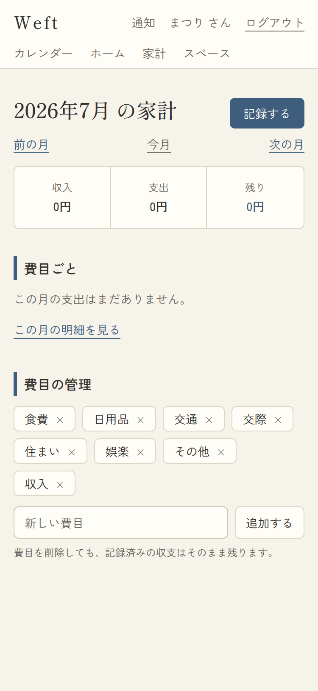

# 07. 家計

- URL: `/expenses?month=YYYY-MM` / アクセス: 要ログイン / 対応項番: F-05-2, F-05-3

自分の収支(共有された他人の収支は含まない)の月次集計。集計はDBのRPC(RLS適用)。

| 記録あり | 空(新規ユーザー) |
|---|---|
|  |  |

## 画面項目

| No | 項目 | 内容・表示条件 |
|---|---|---|
| 1 | 見出し「YYYY年M月 の家計」 | 常時 |
| 2 | つける(藍ボタン) | 常時 → `/items/new?type=expense` |
| 3 | まえの月 / 今月 / つぎの月 | 常時 |
| 4 | 三面サマリー | 常時: はいり(収入計)/ つかい(支出計)/ のこり(差引)。**のこりは正=藍・負=あかね色+−表記** |
| 5 | 費目ごとの棒グラフ | **支出があるとき**。費目名+金額+件数、藍色の横棒(最大支出=100%)。CSSのみで描画 |
| 6 | 支出なしの文言 | 支出0件時「この月の支出はまだありません。」 |
| 7 | この月の明細をみる | 常時 → `/calendar?view=list&month=` |
| 8 | 費目の管理(F-05-2) | 常時。費目チップ(×で削除)+追加フォーム(20文字まで)。注記「費目を除いても、記録済みの収支はそのまま残ります。」 |

## 処理

| 操作 | 処理・遷移 |
|---|---|
| つける | 収支作成フォームへ |
| 月移動 | `?month=` ±1 |
| 費目 × | removeCategory(即削除。記録済みデータへの影響なし) |
| 費目 加える | addCategory(重複名は無視・末尾に追加) |

## パターン

| パターン | 挙動 |
|---|---|
| 収支0件 | サマリーは全て0円、グラフ非表示+No.6 |
| 収入のみ | のこり=収入計(藍)、グラフ非表示 |
| month不正 | 今月にフォールバック |
