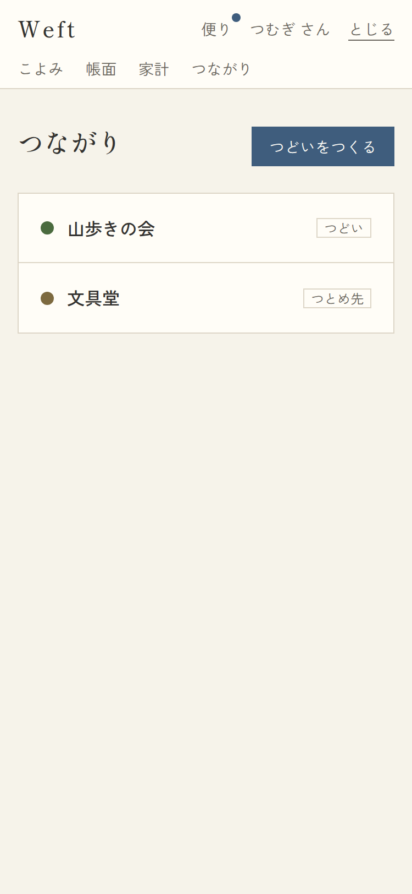
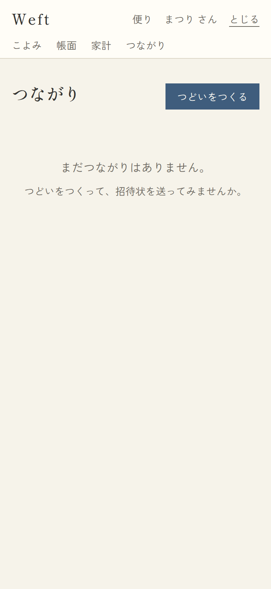
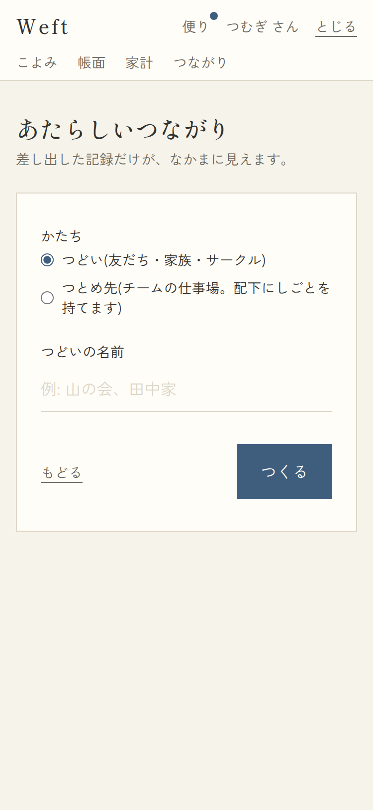

# 08. つながり(スペース一覧・作成)

## 8-1. つながり一覧

- URL: `/spaces` / アクセス: 要ログイン / 対応項番: F-02

| 参加あり | 空 |
|---|---|
|  |  |

| No | 項目 | 内容・表示条件 |
|---|---|---|
| 1 | 見出し「つながり」 | 常時 |
| 2 | つどいをつくる(藍ボタン) | 常時 → `/spaces/new` |
| 3 | スペースリスト | **参加スペース(personal除く・親を持つprojectは除く)があるとき**。1行=しるし色の丸+名前+種別ラベル(つどい/つとめ先)→ `/spaces/{id}` |
| 4 | 空状態 | 「まだつながりはありません。/ つどいをつくって、招待状を送ってみませんか。」 |

※ しごと(project)は親のつとめ先の「しごと」タブから辿る(この一覧には出さない)。

## 8-2. あたらしいつながり(作成)

- URL: `/spaces/new` / 対応項番: F-02-1

| No | 項目 | 種別 | 必須 | 内容 |
|---|---|---|---|---|
| 1 | かたち | radio | ○ | つどい(既定)/つとめ先。説明文つき |
| 2 | つどいの名前 | input | ○ | 1〜50文字。placeholder「例: 山の会、田中家」 |
| 3 | エラー文言 | alert | − | 「グループ名は1〜50文字で入れてください。」等 |
| 4 | もどる / つくる | リンク/ボタン | − | 送信中「つくっています…」 |

| 操作 | 処理 | 成功時 |
|---|---|---|
| つくる | RPC create_group / create_organization(作成者がowner=世話役に) | 作成したスペースの回覧板へ |

## パターン

| パターン | 挙動 |
|---|---|
| つどい作成 | タブ: 回覧板/こよみ/アルバム/精算/なかま/設定 |
| つとめ先作成 | タブ: 回覧板/こよみ/しごと/なかま/設定 |
| 名前が空・51文字以上 | alert表示 |
