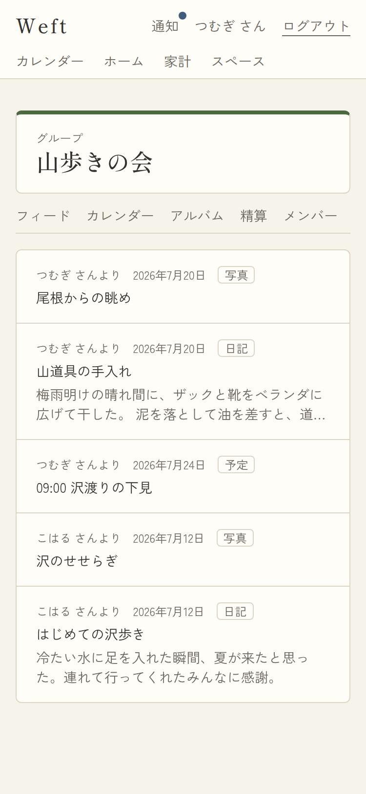
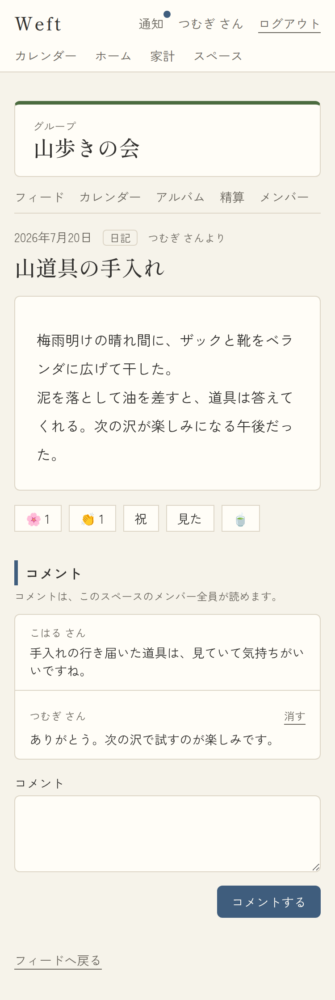
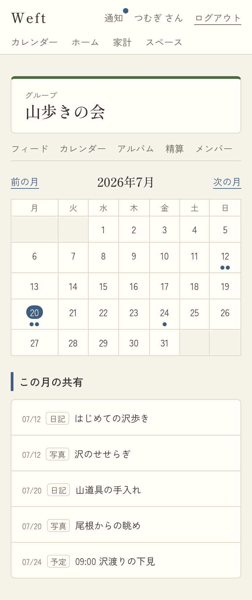
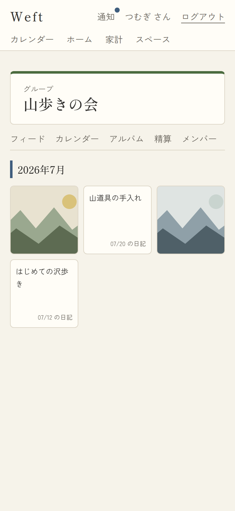
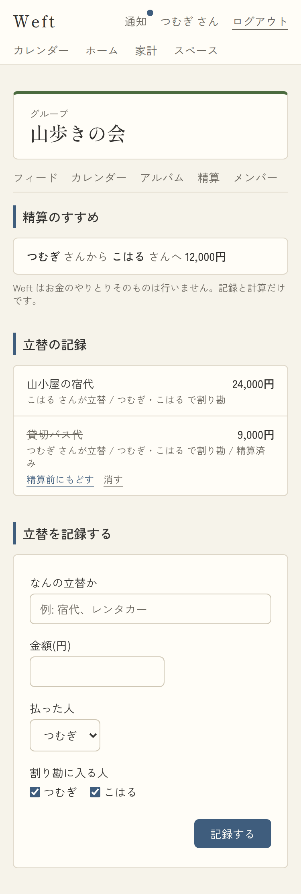

# 09. グループ内の画面

- URL: `/spaces/{id}/…` / アクセス: **そのスペースのメンバーのみ**(非メンバーはRLSで404)
- 共通枠: スペースのテーマカラーの上帯+名前+種別、タブ(フィード/カレンダー/アルバム/精算/メンバー/設定 ※§4.3により種別で変化)

## 9-1. フィード

- 対応項番: F-07-3, F-06-5 / `?page=N`(20件/頁)

| No | 項目 | 内容・表示条件 |
|---|---|---|
| 1 | 共有リスト | 共有された記録を**共有時刻の新しい順**。1行=「◯◯ さんより」+発生日+種別+一行表記(+日記は本文2行)→ 9-2へ |
| 2 | 空状態 | 「まだ共有された記録がありません。/ 記録の詳細ページから、このスペースに共有できます。」 |
| 3 | ページネーション | 21件以上。「新しい方 / 古い方」 |

## 9-2. 共有アイテム(コメント・リアクション)

- URL: `/spaces/{id}/items/{itemId}` / 対応項番: F-07-4, F-07-5(**このスペースへ共有中のアイテムのみ**。それ以外は404)

| No | 項目 | 内容・表示条件 |
|---|---|---|
| 1 | 日付+種別+「◯◯ さんより」 | 常時 |
| 2 | 本文カード | 種別別(06と同様の簡易版) |
| 3 | スタンプ列(F-07-5) | 常時: 🌸 👏 祝 見た 🍵 の5種。**押下済みは藍地白文字+件数**。タップでトグル(押す⇄取り消す) |
| 4 | コメント一覧(F-07-4) | コメント時系列。各=名前+本文。**自分のコメントのみ「消す」**。注記「コメントは、このスペースのメンバー全員が読めます。」(不変条件3・4=非公開返信なし) |
| 5 | コメント入力 | textarea(2000字まで)+「コメントする」 |
| 6 | フィードへ戻る | → 9-1 |

処理: スタンプ/コメント/消す は即時反映。コメント・スタンプでアイテム作成者へ通知が届く。

## 9-3. カレンダー(共有カレンダー)

- 対応項番: F-07-1 / `?month=YYYY-MM`

| No | 項目 | 内容 |
|---|---|---|
| 1 | 月ナビ+月グリッド | このスペースへ共有された記録のみ。ドットはスペース色ベース(藍) |
| 2 | この月の共有 | 月内の共有記録リスト(日付+種別+一行)→ 9-2へ |
| 3 | 空状態 | 「この月に共有された記録はありません。」 |

## 9-4. アルバム

- 対応項番: F-07-2 / `?page=N`(30件/頁)

| No | 項目 | 内容・表示条件 |
|---|---|---|
| 1 | 月見出し(明朝) | 記録がある月ごと(新しい月から) |
| 2 | グリッド(3列) | **写真**=正方形サムネイル(署名付きURL・遅延読込)/ **日記**=タイトル(または本文)4行+「M/D の日記」のカード。タップ→ 9-2 |
| 3 | 空状態 | 「まだ写真や日記がありません。/ 写真や日記を共有すると、ここに集まります。」 |

## 9-5. 精算(立替)

- 対応項番: F-07-6(送金はしない。記録と計算のみ=§9)

| No | 項目 | 内容・表示条件 |
|---|---|---|
| 1 | 精算のすすめ | **未精算(open)の立替から算出した精算案**:「◯◯ さんから ◯◯ さんへ N円」。貸し借りなし時「いまのところ、貸し借りはありません。」注記「Weft はお金のやりとりそのものは行いません。…」 |
| 2 | 立替の記録 | 新しい順。1行=タイトル+金額 / 立替者と割り勘対象 / 精算済みはタイトルに取り消し線+「精算済み」 |
| 3 | 行の操作 | **記録した本人か払った本人のみ**:「精算済みにする⇄精算前にもどす」「消す」 |
| 4 | 立替を記録する | フォーム: なんの立替か(必須100字)/ 金額(円)(1以上整数)/ 払った人(select・既定=自分)/ 割り勘に入る人(checkbox・既定=全員) |
| 5 | エラー文言 | `?error=1` 時「記録できませんでした。入力をお確かめください。」 |

計算仕様: 割り勘は等分・**割り切れない端数は払った人が負担**。精算案は残高の大きい順に相殺する貪欲法(`src/lib/settle.ts`・ユニットテストあり)。

## パターン(グループ共通)

| パターン | 挙動 |
|---|---|
| 非メンバーがURL直打ち | 404(スペースの存在も見せない) |
| 共有が解除された記録 | フィード・アルバム・カレンダーから消える(9-2も404) |
| 写真の署名URL期限切れ(1時間) | 再読み込みで再発行 |
