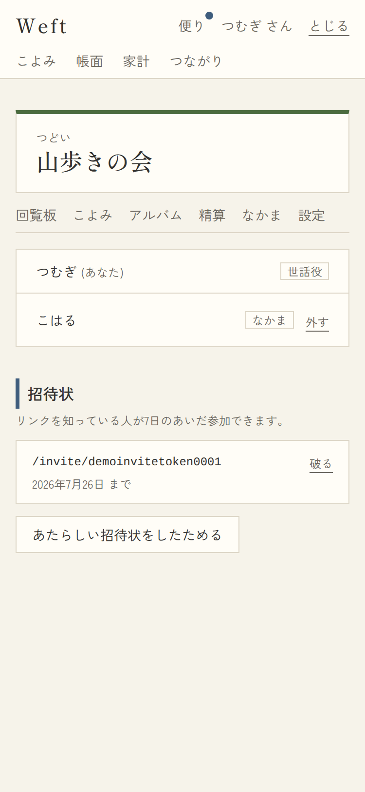
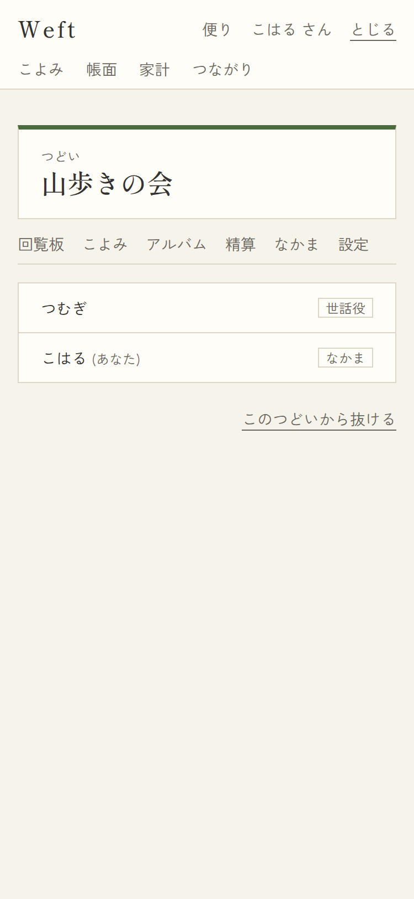
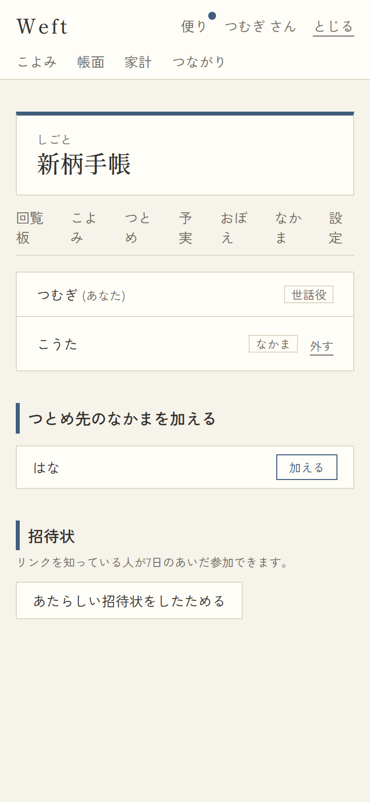
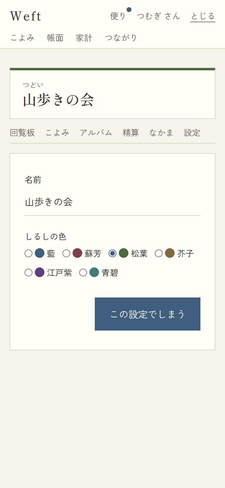
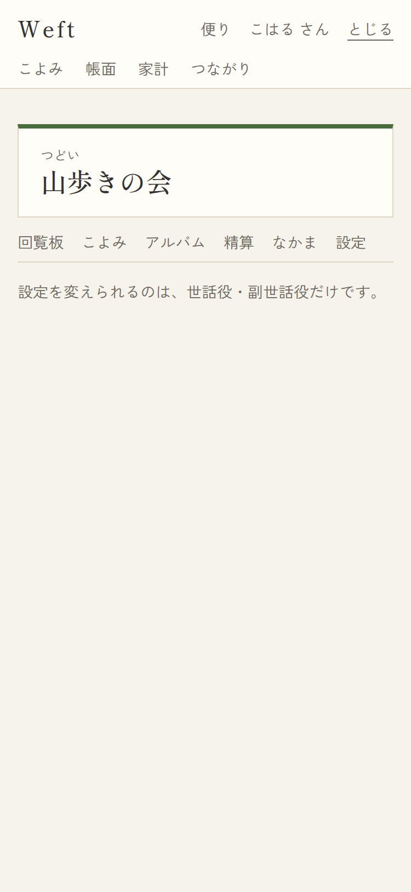
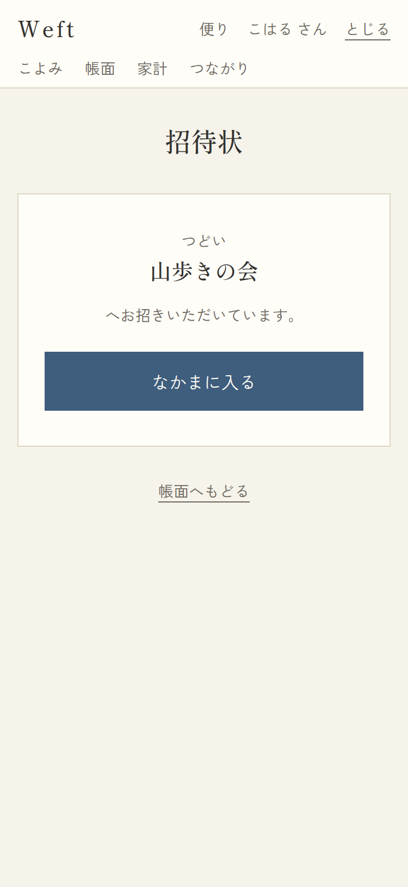
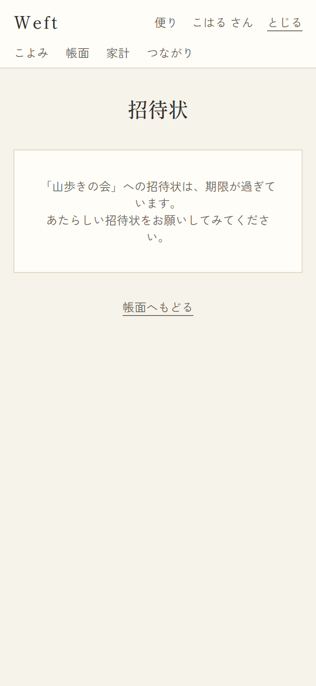
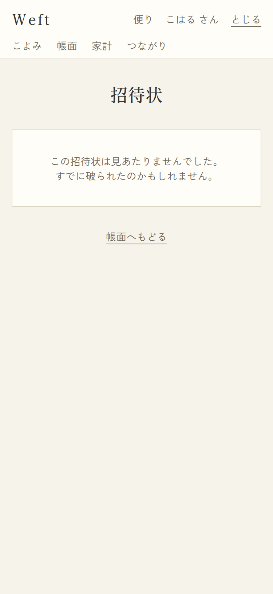

# 10. なかま・設定・招待

## 10-1. なかま(メンバー一覧)

- URL: `/spaces/{id}/members` / 対応項番: F-02-3/4/5

| 世話役(owner)の見え方 | なかま(member)の見え方 | しごと(project)の場合 |
|---|---|---|
|  |  |  |

### 画面項目

| No | 項目 | 内容・表示条件 |
|---|---|---|
| 1 | メンバーリスト | 参加順。名前+「(あなた)」+ロールラベル(世話役/副世話役/なかま) |
| 2 | 外す | **自分がowner/admin かつ 相手が自分以外かつowner以外**のときのみ行に表示。即除名(F-02-5。相手の共有は残る=本人が解除可能) |
| 3 | このつどいから抜ける | **自分がowner以外**のときのみ表示(ownerは抜けられない)→ 退出して `/spaces` へ |
| 4 | つとめ先のなかまを加える | **projectのみ、owner/adminのみ、親組織に未参加候補がいるとき**。候補リスト+「加える」→ member として即追加 |
| 5 | 招待状セクション | **owner/adminのみ**(memberには丸ごと非表示=スクリーンショット中央)。注記「リンクを知っている人が7日のあいだ参加できます。」 |
| 6 | 招待リンク行 | 有効期限内の招待のみ。`/invite/{token}` のコード表示+期限+「破る」(削除) |
| 7 | あたらしい招待状をしたためる | 押下で発行(トークン・期限7日はDB採番) |

## 10-2. 設定

- URL: `/spaces/{id}/settings` / 対応項番: F-02-6

| owner/admin(編集可) | member(閲覧のみ) |
|---|---|
|  |  |

| No | 項目 | 内容・表示条件 |
|---|---|---|
| 1 | 名前 | input(1〜50字) |
| 2 | しるしの色 | radio: 藍/蘇芳/松葉/芥子/江戸紫/青碧(和色6種・**1スペース1色**)。レイヤー・バッジ・上帯に反映 |
| 3 | この設定でしまう | 送信。RLS=owner/adminのみ(memberはフォーム自体が出ず「設定を変えられるのは、世話役・副世話役だけです。」) |

## 10-3. 招待状(受け取り)

- URL: `/invite/{token}` / 対応項番: F-02-3(未ログインなら `/login?next=` 経由で戻ってくる)

| 有効 | 期限切れ | 無効トークン |
|---|---|---|
|  |  |  |

| No | 項目 | 内容・表示条件 |
|---|---|---|
| 1 | スペース種別+名前 | **有効なトークンのみ**(RPC invitation_preview。トークン自体は非メンバーに読めないためRPC経由) |
| 2 | なかまに入る | 有効時のみ。RPC accept_invitation → member登録(冪等)→ そのスペースの回覧板へ |
| 3 | 期限切れ文言 | 「…期限が過ぎています。あたらしい招待状をお願いしてみてください。」 |
| 4 | 無効文言 | 「この招待状は見あたりませんでした。すでに破られたのかもしれません。」 |
| 5 | エラー文言 | `?error=1`(受諾失敗)時「参加できませんでした。もう一度お試しください。」 |
| 6 | 帳面へもどる | 常時 |

## パターン

| パターン | 挙動 |
|---|---|
| 参加済みの人が有効な招待を開く | 「なかまに入る」→ そのまま回覧板へ(重複登録されない) |
| owner除名・owner退出 | UI非表示+RLSでも拒否(つどいが世話役不在にならない) |
| 招待を「破る」 | 以後そのリンクは無効(受け取り側は「見あたりません」表示) |
