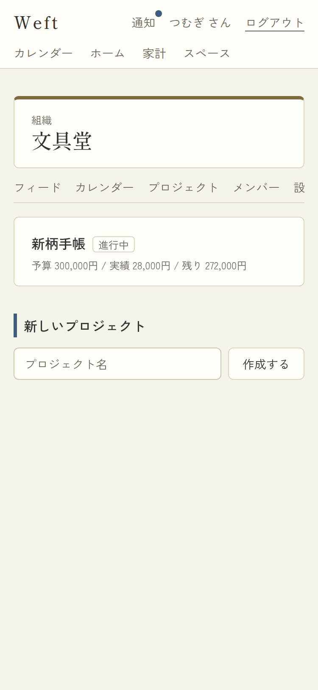
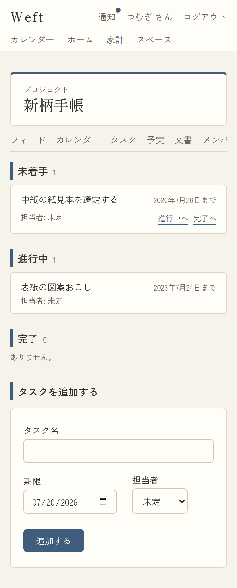
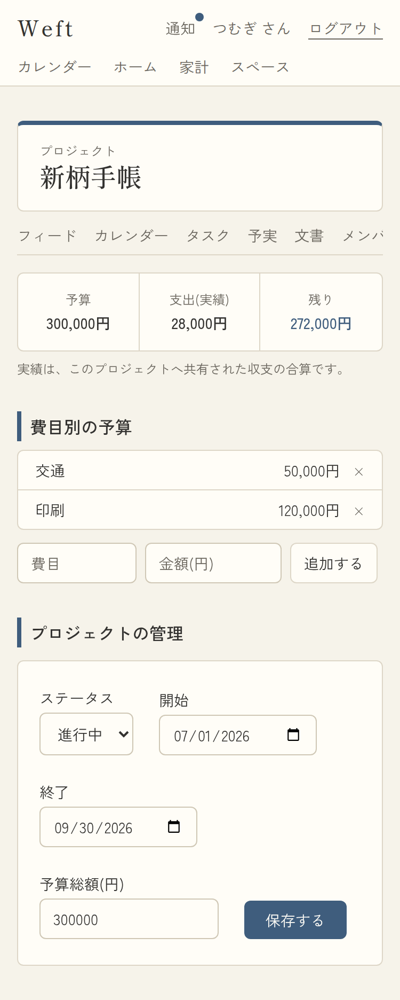
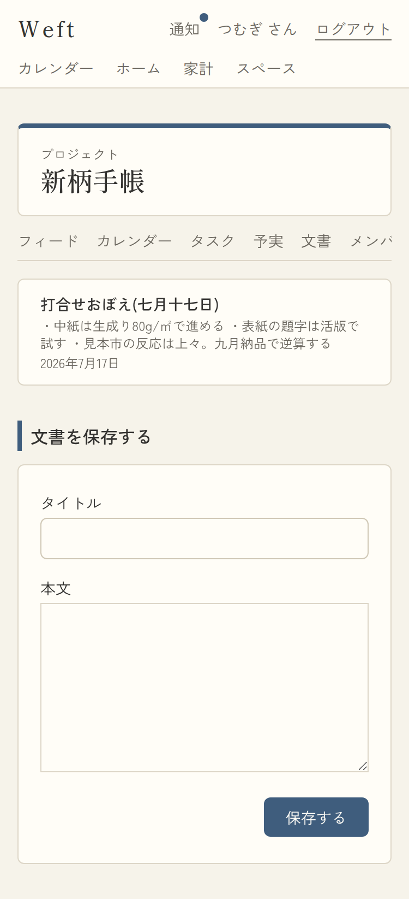
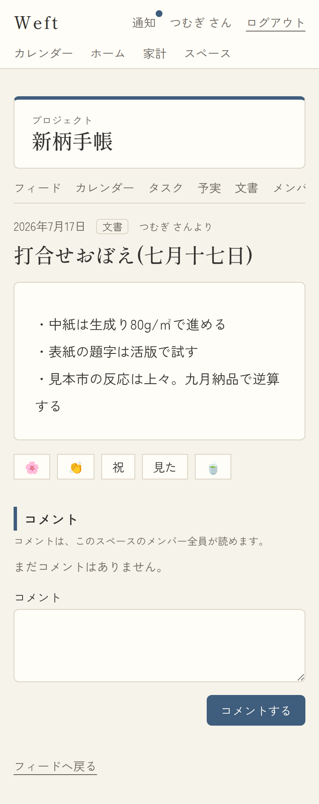

# 11. 組織・プロジェクト

- アクセス: メンバーのみ。**組織のメンバーでも、プロジェクトに参加していなければ中身は見えない**(§6.3)
- 例外: 組織のowner/adminは配下のプロジェクトの「名前と予実・状態」だけ一覧で見える(F-08-5)

## 11-1. プロジェクト一覧(組織ダッシュボード)

- URL: `/spaces/{orgId}/projects` / 対応項番: F-02-2, F-08-5

| No | 項目 | 内容・表示条件 |
|---|---|---|
| 1 | プロジェクトリスト | 配下プロジェクト。名前(**参加中のみリンク**・非参加は薄墨の文字のみ)+状態ラベル(準備中/進行中/完了) |
| 2 | 予実行 | 「予算 N円 / 実績 N円 / 残り N円」。**実績は参加しているプロジェクトのみ**(非参加は「実績は参加者のみ閲覧できます」=§6.3) |
| 3 | 新しいプロジェクト | **組織のowner/adminのみ**。名前入力+「作成する」→ RPC create_project(作成者がプロジェクトのowner)→ 新しいプロジェクトのフィードへ |
| 4 | 空状態 | 「まだプロジェクトはありません。」 |

## 11-2. タスク

- URL: `/spaces/{projectId}/tasks` / 対応項番: F-08-2

| No | 項目 | 内容・表示条件 |
|---|---|---|
| 1 | ステータスセクション | 未着手/進行中/完了 の3段(件数つき)。0件は「ありません。」 |
| 2 | タスク行 | タイトル(→共有アイテム画面)+「M月D日まで」+担当者(未定は「未定」) |
| 3 | 移動ボタン | **作成者か担当者のみ**「◯◯へ」×2(他の2状態へ)。RPC update_task_status(**本文は書き換え不可**の唯一の例外操作) |
| 4 | タスクを追加する | メンバー全員。タスク名(必須100字)/期限(date)/担当者(select: 未定+メンバー)→ 作成と同時にプロジェクトへ共有。担当者には通知(task_assigned) |

## 11-3. 予実

- URL: `/spaces/{projectId}/budget` / 対応項番: F-08-1, F-08-3, F-05-5

| No | 項目 | 内容・表示条件 |
|---|---|---|
| 1 | 三面サマリー | 予算(projects_meta.budget_total)/ つかい(実績=**このプロジェクトへ共有された収支の合算**・RPC)/ 残り(負はあかね色) |
| 2 | 損益行 | **収入実績があるとき**「はいり(実績): N円 / 損益: N円」(F-05-5) |
| 3 | 実績の注記 | 常時「実績は、このプロジェクトへ共有された収支の合算です。」 |
| 4 | 費目別の予算 | budgets一覧(費目+金額)。**owner/adminのみ**追加フォーム(費目20字+金額)と×(削除) |
| 5 | プロジェクトの管理 | **owner/adminのみ**(F-08-1): ステータス(select)/開始・終了(date)/予算総額(円) →「保存する」 |

## 11-4. 文書(ナレッジ)

- URL: `/spaces/{projectId}/docs` / 対応項番: F-08-4, F-08-6 / `?page=N`(20件)

| 一覧+作成 | 詳細(コメント可) |
|---|---|
|  |  |

| No | 項目 | 内容・表示条件 |
|---|---|---|
| 1 | 文書リスト | 新しい順。タイトル+本文2行+日付 → 共有アイテム画面(コメント・スタンプ可=議論の場) |
| 2 | 空状態 | 「まだ文書はありません。」 |
| 3 | 文書を保存する | タイトル(必須100字)+本文(必須)→ 作成と同時にプロジェクトへ共有 |
| 4 | エラー文言 | `?error=1`「保存できませんでした。タイトルと本文の両方を入力してください。」 |

※ 文書とタスク・予定の双方向リンク(F-08-6)は、作成者が自分のアイテム詳細(06)の「結びつける」から張れる。

## パターン

| パターン | 挙動 |
|---|---|
| 組織メンバー(非owner/admin)が /projects | プロジェクト一覧は見えるが「新しいプロジェクト」非表示・非参加のプロジェクトは実績非表示 |
| 組織メンバーがプロジェクトのURL直打ち | 404(参加するまで中身は存在ごと不可視=§6.3) |
| member が予実を開く | サマリー・予算は閲覧可。追加フォーム・管理は非表示 |
| 担当者でも作成者でもない人のタスク | 移動ボタン非表示(RPC側でも拒否) |
