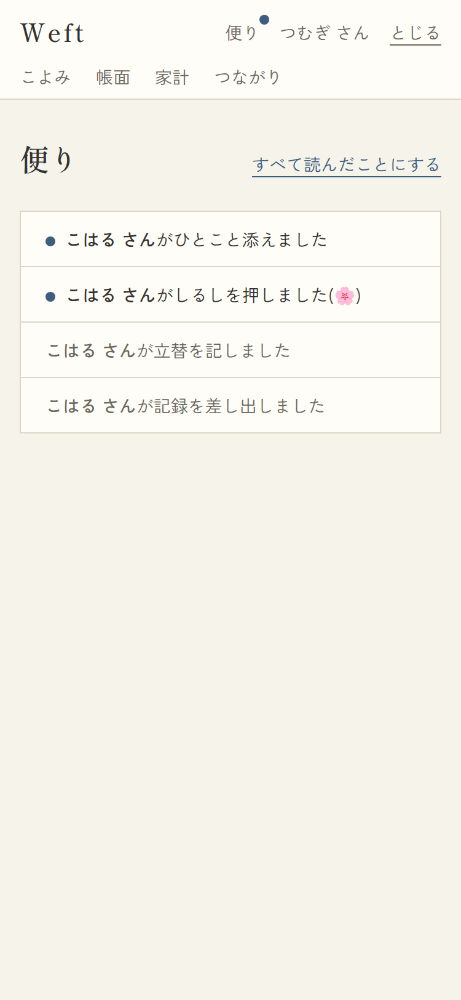
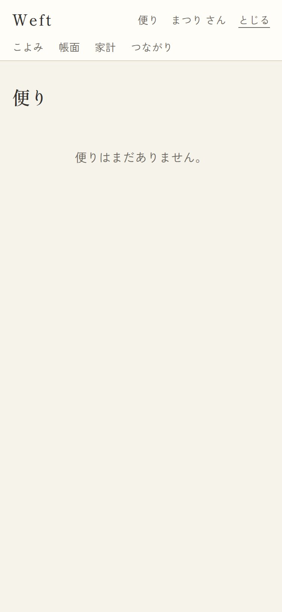
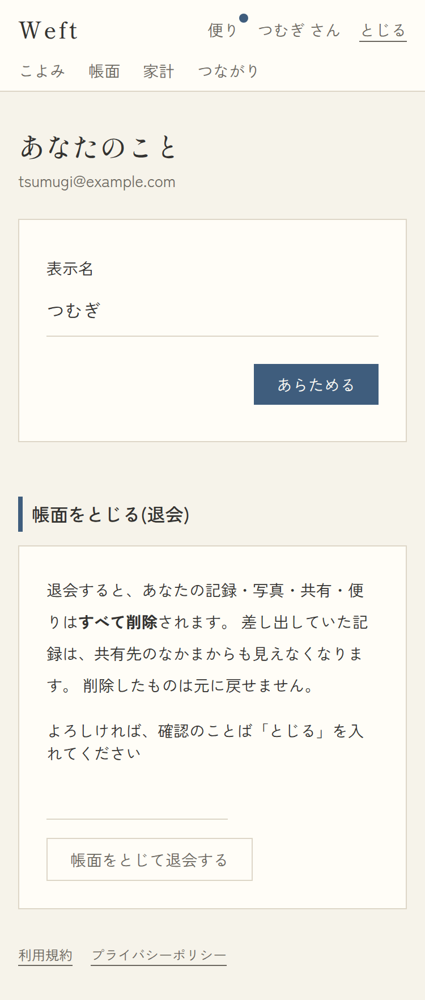

# 12. 便り(通知)・あなたのこと(アカウント)

## 12-1. 便り

- URL: `/notifications?page=N`(30件/頁) / 対応項番: F-11-1

| 便りあり(未読・既読混在) | 空 |
|---|---|
|  |  |

### 画面項目

| No | 項目 | 内容・表示条件 |
|---|---|---|
| 1 | すべて読んだことにする | **未読が1件以上あるとき**(このページ内)。押下で未読すべてを既読化 |
| 2 | 便りリスト | 新しい順。**未読=藍ドット+濃色 / 既読=薄墨**。文言は種類別(下表) |
| 3 | 空状態 | 「便りはまだありません。」 |

### 便りの種類・文言・タップ先

| type | 文言 | いつ届く(トリガ) | タップ先 |
|---|---|---|---|
| shared | 「◯◯ さんが記録を差し出しました」 | 自分が属するスペースへ共有された時(共有者以外全員) | 共有アイテム画面 |
| comment | 「◯◯ さんがひとこと添えました」 | 自分のアイテムにコメントされた時 | 同上 |
| reaction | 「◯◯ さんがしるしを押しました(🌸)」 | 自分のアイテムにスタンプされた時 | 同上 |
| task_assigned | 「◯◯ さんがつとめの担い手にあなたを選びました」 | 担い手に設定された時 | 同上 |
| settlement | 「◯◯ さんが立替を記しました」 | スペースに立替が記録された時(記録者以外全員) | そのスペースの精算画面 |

ヘッダーの「便り」には未読があるとき藍ドットが付く(全画面共通)。

## 12-2. あなたのこと(アカウント)

- URL: `/account` / 対応項番: F-01-4, F-01-5

### 画面項目

| No | 項目 | 内容・表示条件 |
|---|---|---|
| 1 | メールアドレス | 表示のみ |
| 2 | 表示名 | input(1〜30字)+「あらためる」。成功時「あらためました。」/失敗時alert |
| 3 | 帳面をとじる(退会) | 説明(**全データ削除・共有先からも消える・復元不可**を明示=F-01-5)+確認語入力 |
| 4 | 確認語 | input。**「とじる」と完全一致しないと退会できない**(誤操作防止)。不一致時「確認のことば「とじる」を入れてください。」 |
| 5 | 帳面をとじて退会する | 枠ボタン(押下中「とじています…」) |
| 6 | 規約リンク | 利用規約 / プライバシーポリシー |

### 退会処理の流れ

1. 確認語の一致を検証
2. Storageの自分の写真フォルダを削除
3. service_role(サーバー専用)で auth.admin.deleteUser → **FKカスケードで記録・共有・コメント・便りすべて削除**
4. セッション破棄 → `/login` へ

### パターン

| パターン | 挙動 |
|---|---|
| 表示名が空・31字以上 | 「表示名は1〜30文字で入れてください。」 |
| 確認語不一致 | エラー表示・退会されない |
| 退会後に同じメールで再登録 | 新規ユーザーとして白紙から(過去データは消えている) |
