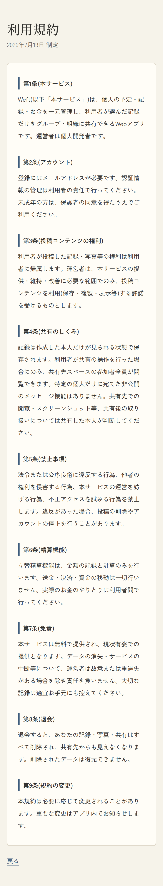
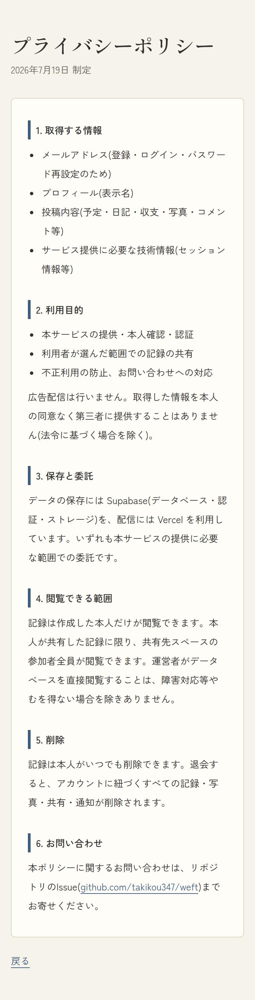

# 13. 静的ページ

- アクセス: **公開(未ログインでも閲覧可)** / 対応項番: §9

| 利用規約 /terms | プライバシーポリシー /privacy |
|---|---|
|  |  |

## 利用規約(9条)

| 条 | 要点 |
|---|---|
| 1 本サービス | 個人開発・選択的共有アプリであること |
| 2 アカウント | 認証情報の自己管理、未成年は保護者同意(§9 年齢) |
| 3 投稿コンテンツ | 権利はユーザー帰属。運営はサービス提供に必要な範囲の利用許諾(§9 UGC) |
| 4 共有のしくみ | デフォルト非公開/共有はスペース全員に可視/**1対1メッセージは無い**(§9 電気通信事業法) |
| 5 禁止事項 | 法令違反・権利侵害・運営妨害・不正アクセス |
| 6 精算機能 | **記録と計算のみ。送金・決済はしない**(§9 資金移動業) |
| 7 免責 | 無償・現状有姿。手元控えの推奨 |
| 8 退会 | 全削除・共有先からも消える・復元不可 |
| 9 変更 | アプリ内で告知 |

## プライバシーポリシー(6項)

| 項 | 要点 |
|---|---|
| 1 取得する情報 | メール・表示名・投稿内容・技術情報 |
| 2 利用目的 | 提供・認証・選択的共有・不正防止。**広告なし・第三者提供なし** |
| 3 保存と委託 | Supabase / Vercel |
| 4 閲覧できる範囲 | 本人+本人が共有した先のみ。運営者の閲覧は障害対応等に限定 |
| 5 削除 | 記録は随時削除可・退会で全削除 |
| 6 お問い合わせ | GitHubリポジトリのIssue |

## 表示・遷移

| 項目 | 内容 |
|---|---|
| 戻るリンク | `/` へ(未ログイン時はmiddlewareが `/login` へ) |
| 導線 | 登録画面の同意文言・アカウント画面下部からリンク |
